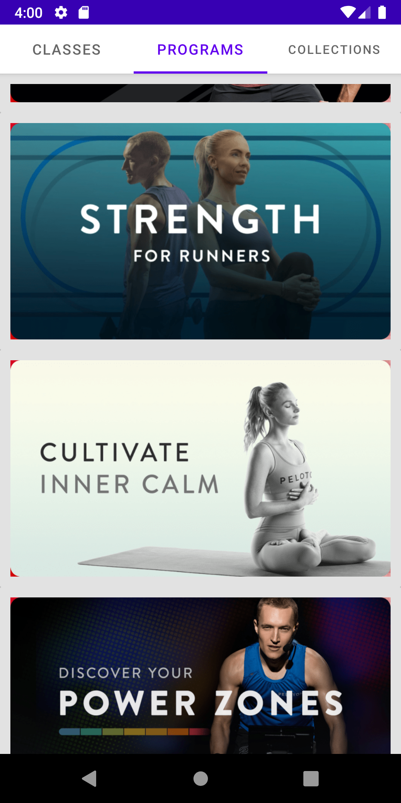

 

## Workout Video Player for Android in Kotlin with MVVM

I coded this app in early 2022. I was planning to apply at a large stationary fitness cycle manufacturer. Their brand is identified with both workout equipment coupled with an app providing real time classes.
So before applying, I decided to clone their workout video app. Not having a video studio or instructors, I decided to use workout videos from Youtube.

Unfortunately, the company hit hard times and is no longer hiring.

In this repo you'll find:
* A main navigation screen built on a single activity with three tabs using a fragment pager.
* User Interface built with a **[ViewModel](https://developer.android.com/topic/libraries/architecture/viewmodel)** for every screen that displays active data.
* Reactive UIs using **[LiveData](https://developer.android.com/reference/androidx/lifecycle/LiveData)**.
* Consumption of a REST api, using Square's **[Retrofit2](https://square.github.io/retrofit/)** library.
* Image loading with BumpTech's **[Glide](https://bumptech.github.io/glide/)** library.

### Screen Shots

<tr>
<td>

</td>
<td>

</td>
<td>

</td>
</tr>

<tr>
<td>

</td>
<td>

</td>
<td>

</td>
</tr>

### Running the app in Android Studio

In order to run the code, you'll need to get an api key from [Youtube](https://youtube.com) and store it in an environment variable on your system called YOUTUBE_APIKEY.

Add YouTube Android player API by downloading from [here](https://developers.google.com/youtube/android/player/downloads). After downloading, extract the file and copy it to the libs folder of the android project.